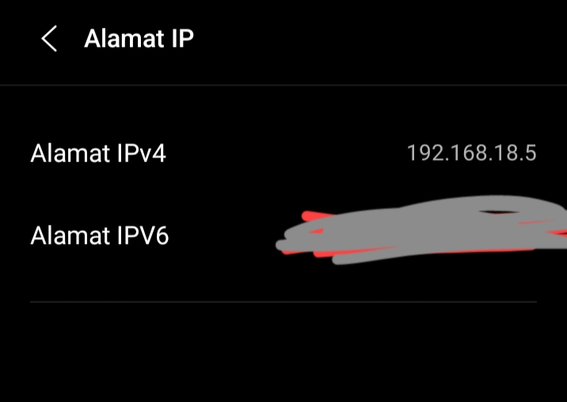

# Indonesia

## LAN

kamu bisa melihat Alamat IP Hp kamu di , tentang ponsel > status > alamat IP

Lihat video ini jika kamu ingin melihat tutorial menyalakannya dengan scrcpyLAN

<!-- give a gif -->

## USB

Kamu bisa melihat tutorial dari video youtube ini (kamu perlu untuk menekan gambarnya)

 
 

------------------------------------------------------------

# English

## LAN

You can see the IP in about phone > status > IP address

see the video if you want to know tutorial

<!-- give a gif -->

## USB

You can see the tutorial from this video youtube (you need to click the image)

